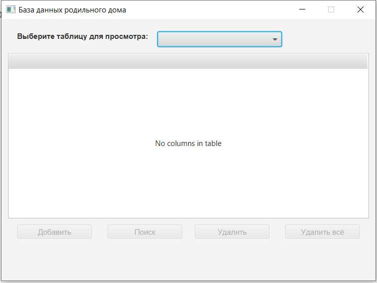
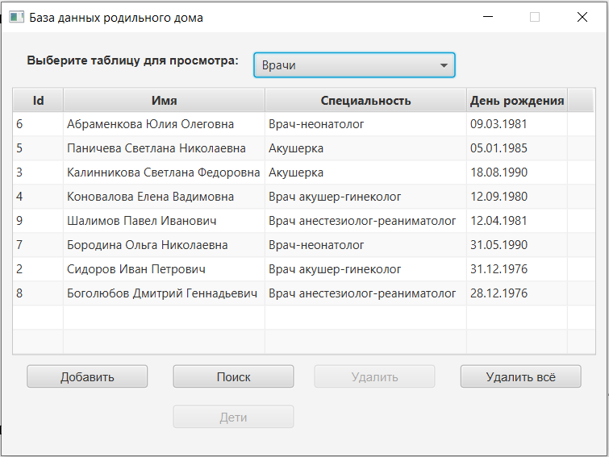
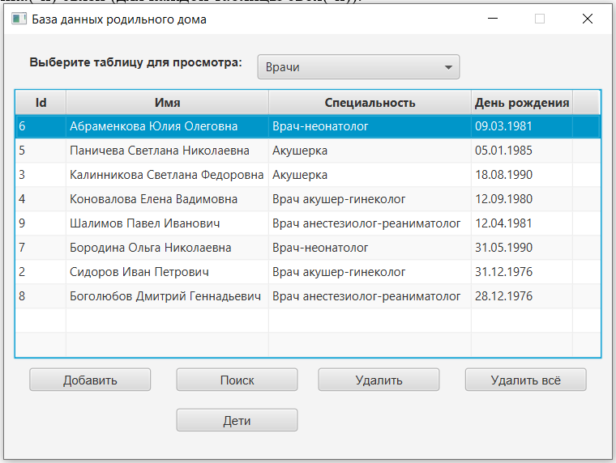
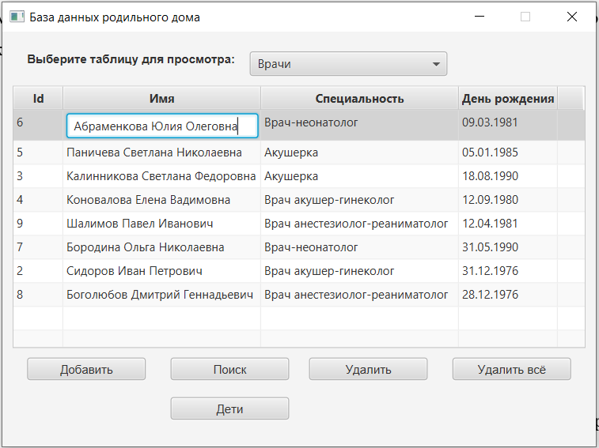
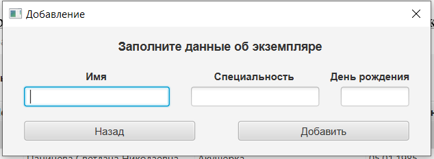
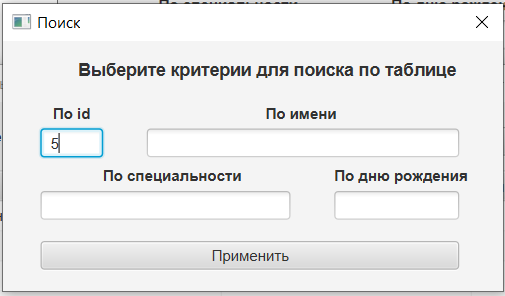
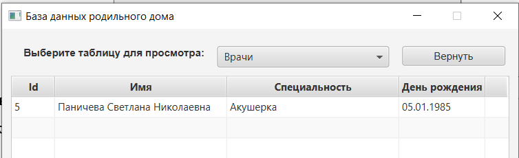
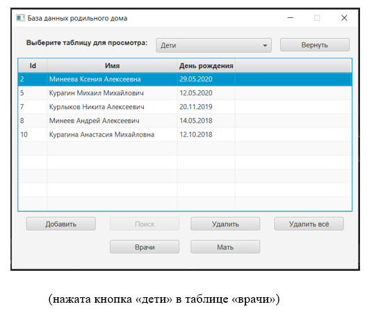
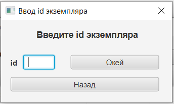

### О программе
Это десктопное приложение для автоматизации систем управления данными родильного дома, предназначенная для ввода, редактирования и использования информации о врачах, палатах, детях и их матерях.

Данный проект был создан в качестве курсовой работы.

Он написан на языке Java с использованием JavaFX и собран через Maven.
Также в нем присутствует фреймворк Hibernate для связи с базой данных и отправки запросов в нее.
База данных составлена в PostgreSQL.

***
### Системные требования
**Проверял только на своем ПК**

ОЗУ: 250МБ

Жеский диск: 40МБ (файл .jar)

ОС: Windows 10
***
### Как запустить
Я создавал исполнительный.jar файл, через который открывал приложение, но git не пропускает его по размеру, поэтому ловите ссылку на скачивание .jar

https://drive.google.com/file/d/1Hr97CyBsPwW9Ysp8Xg6azBFAxtoTVPyx/view?usp=sharing
***
### Как пользоваться
Для использования приложения Вам потребуются мышка и клавиатура.

При запуске программы перед пользователем открывается меню. На данном этапе все кнопки находятся в нерабочем состоянии.

Далее следует выбрать таблицу для просмотра (врачи, дети, матери или палаты). После этого появится возможность использования кнопок: «добавить», «поиск», «удалить всё».

При одиночном нажатии на экземпляр активируется кнопка «удалить», а также кнопка(-и) связи (для каждой таблицы своя(-и)).

При двойном нажатии левой кнопкой мыши на атрибут экземпляра появится возможность редактировать выбранное поле. После окончания редактирования нужно нажать на кнопку «Enter».

При нажатии на кнопку «добавить» откроется окно заполнения экземпляра.

При нажатии на кнопку «поиск» откроется окно поиска. Искать экземпляр(-ы) можно по любому атрибуту, также их можно комбинировать. В случае отсутствия данного экземпляра таблица будет пуста.

После задания фильтра необходимо нажать кнопку «применить». В таблице появятся отфильтрованные экземпляры. Для выхода из окна поиска без фильтрации нужно нажать на кнопку «применить», но все поля должны быть пустые.

Также в правом верхнем углу появится кнопка «вернуть». Ее необходимо нажать после завершения работы с поисковиком.

У каждой таблицы есть своя кнопка(-и) связи. При нажатии на нее появится соответствующая таблица с привязанными к данному экземпляру экземплярами.

В данном окне все кнопки работают по тому же принципу, что и ранее, но уже изменяя связь между экземплярами:

•	«Добавить» - добавляет связь между экземплярами (открывается окно, в которое нужно записать «id» экземпляра, которого нужно привязать).

•	«Удалить» - удаляет связь между экземплярами.

•	«Удалить всё» - удаляет все связи с выбранным экземпляром.

•	«Вернуть» - возвращает обратно таблицы базы данных.

*Исключение:* изменение атрибутов экземпляра сохраняется в базе.

